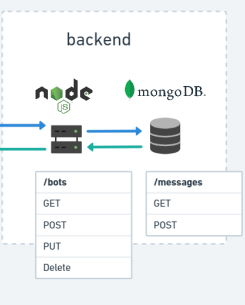

# Descrição

Este projeto é uma API básica de chatbot que permite aos usuários criar, ler, atualizar e excluir chatbots, bem como criar e ler mensagens. Ele é construído usando Node.js, TypeScript e MongoDB. A API usa a estrutura Express.js e foi projetada para ser fácil de usar e escalável. O projeto também inclui validação básica e tratamento de erros, bem como testes com Jest. A API é equipada com registro e gerenciamento de variáveis ​​de ambiente usando o pacote dotenv e conteinerizado com o Docker para facilitar a implantação.



## Tecnologias utilizadas

```
dotenv:Para carregar variáveis de ambiente.
express:Criação da API.
body-parser:Trabalhar com os dados vindos da requisição.
express-winston:Log de requisições.
jest: Testes automatizados.
mongoose: Interação com o banco MongoDB.
ts-jest e ts-node: Para utilizar typescript no projeto com testes.
supertest:Para testar as requisições da API
cross-env:Para possibilitar o uso de multiplos sistemas operacionais
jest-junit:Para utilizar Coverage e salvar os resultados dos testes em xml
```

## Getting started

Para conseguir rodar o código preencha as variaveis de ambiente no .env, há um .env.example para o apoio.

```
DB_HOST=
DB_PORT=
DB_NAME=
PORT=

```

Instalar as dependencias com:

```
npm i
```

Para subir o mongodb:

```
docker-compose up -d
```

Para rodar a api:

```
npm run start
```

Para rodar os testes:

```
npm run test
```

A collection no Postman está no arquivo backend-test-bra.postman_collection.json
